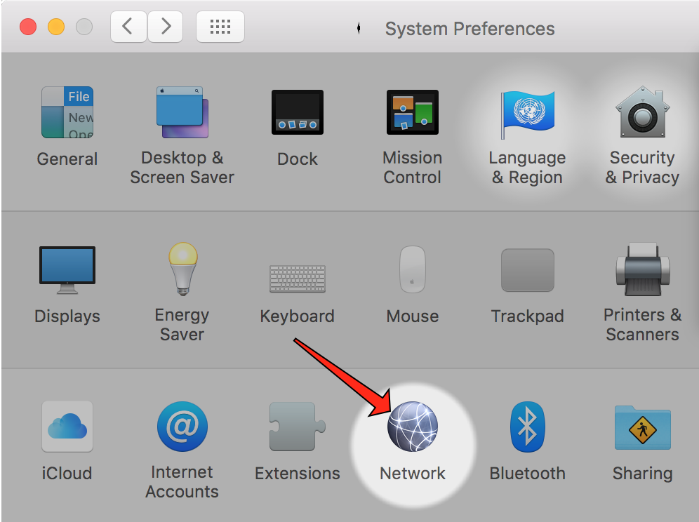
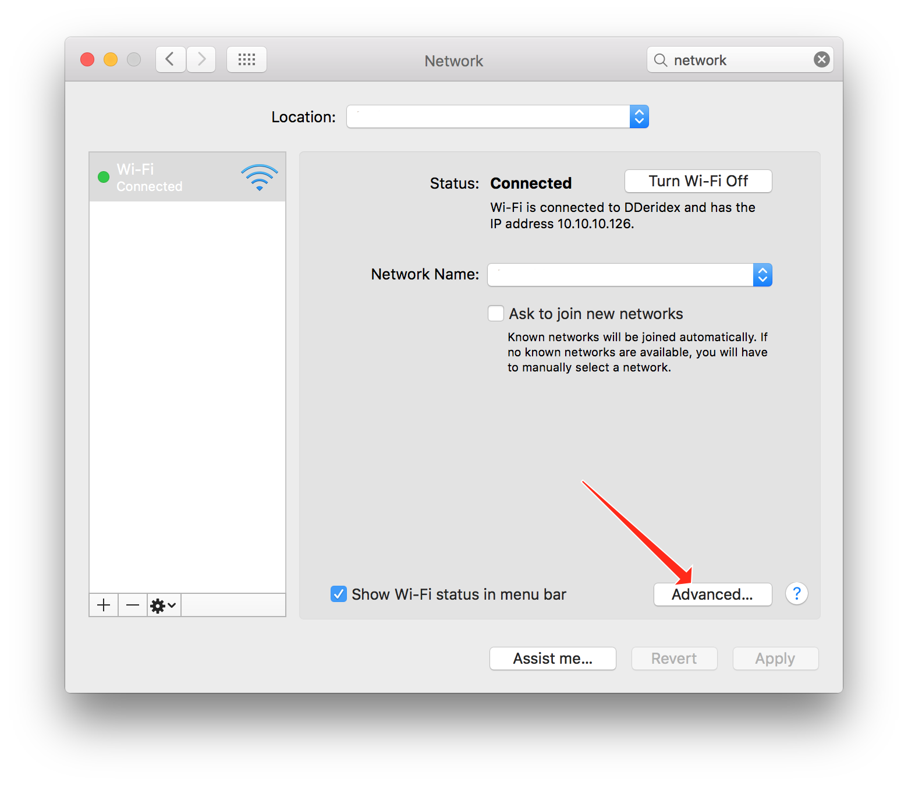
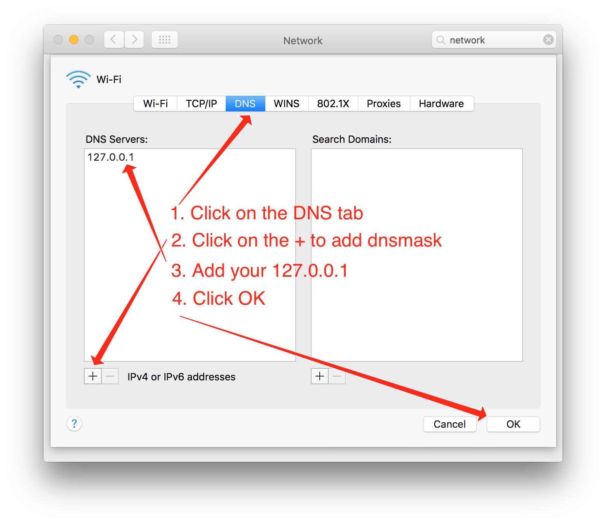

# K8S

## How to resolve minikube services on your mac

To be able to use the service names in your browser or in the terminal, two solutions can be use.

You can manually add them to your /etc/hosts file on your machine.

```bash
MINIKUBEIP=$(minikube ip | tr -cd '[0-9.]')
sudo echo "${MINIKUBEIP} kibana.cluster.local cerebro.cluster.local elasticsearch.cluster.local' >> /etc/hosts
```
The main disadventage of this solution is that each time you add/remove a service, you will have to manually append/remove it to the /etc/hosts file. Furthermore, if your minikube changes IP address (e.g. after the vm as gone to sleep, or after a rebbot) you will have to manually edit the /etc/hosts file to replace the IP address by the new  one.

A more dynamic solution is to install dnsmasq and configure it once to  dynamically manage your minikube services! The disadventage of this solution is that you have to be ok using the Google Public DNS to resolve all other DNS entry or know enough about DNS to configure DNSMASQ to use your original DNS.

### Use dnsmasq to resolve minikube services

```bash
$ brew install dnsmasq
$ sed -e 's/#conf-dir=.etc.dnsmasq.d.,\*.conf/conf-dir=\/etc\/dnsmasq.d\/,*.conf/' /usr/local/opt/dnsmasq/dnsmasq.conf.example > /usr/local/etc/dnsmasq.conf
$ sudo mkdir -p /etc/dnsmasq.d
$ sed -e 's/192.168.99.100/'$(minikube ip | tr -cd '[0-9.]')'/' samples/dnsmasq/minikube.cluster.local.conf > /etc/dnsmasq.d/minikube.cluster.local.conf
$ sudo brew services start dnsmasq
```

If dnsmasq started successfully you can replace your origin DNS configuration with DNSMASQ.

A successful message would look like this:
```
==> Successfully started `dnsmasq` (label: homebrew.mxcl.dnsmasq)
```

---

#### Open your system preferences and click on `Network`



---

#### Click on the `Advanced...` button



---

#### Use dnsmasq instead of your origin DNS server.

I recommend that you write down the original `DNS Servers` after step (1), in case you want to restore them.

1. Click on the `DNS` tab.
2. Click on the `+` to add a new DNS server
3. Type `127.0.0.1` as your DNS server.
4. Click `OK` to save your changes.


You can now close the `System Preferences` pane.

---

From here on, if you created a service like `elasticsearch` you can open your brower at [http://elasticsearch.cluster.local/](http://elasticsearch.cluster.local/) and you should see the output of elasticsarch

```
{
  "name" : "25mrZ2c",
  "cluster_name" : "diagnostic",
  "cluster_uuid" : "TqweEM7MYEJ-asHb6d_Q1Ppoz",
  "version" : {
    "number" : "5.2.0",
    "build_hash" : "24e05b9",
    "build_date" : "2017-01-24T19:52:35.800Z",
    "build_snapshot" : false,
    "lucene_version" : "6.4.0"
  },
  "tagline" : "You Know, for Search"
}
```
